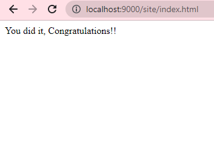

# HAZESOFT-T1
## _NGINX AND LINUX DOCKERFILE_
## Prerequisites

- To use this Dockerfile, you need to have Docker installed on your machine. 
- Download docker: https://www.docker.com.


Install Docker desktop and integrate it with wsl if you are using linux distro

## Understanding Dockerfile

This dockerfile uses Linux Alpine as its base OS and uses nginx to serve content from a git repo: https://github.com/veekrum/task

Use **Linux Alpine** image as the base OS
```sh
FROM alpine:latest
```

Update the packages and install necessary packages i.e **nginx** and **git**
```sh
RUN apk update 
RUN apk add nginx
RUN apk add git
```

Copy the created **conf file** into the configuration folder
```
COPY nginx.conf /etc/nginx/nginx.conf
```

Create a **working directory**
```
WORKDIR /usr/share/nginx/html
```

**Clone** the repo into your working directory
```
RUN git clone https://github.com/veekrum/task
```

Expose the required **ports**
```
EXPOSE 9000
EXPOSE 80
```

Start the **nginx server**
```
CMD ["nginx", "-g", "daemon off;"]
```
And of course Dillinger itself is open source with a [public repository][dill]
 on GitHub.

## Understandng conf file
/site indicate **localhost/site** that has the root directory to **/usr/share/nginx/html/task**
```
server {
    listen 80;
    server_name localhost;

    location /site {
        root /usr/share/nginx/html/task;
        index index.html;
    }
}
```

## How to run

Create a docker image in your current directory
```
docker build -t <your_docker_name> .
```

Map port 9000 on the host to port 80 in the container
```
docker run -p 9000:80 <your_docker_name>
```

# Output



